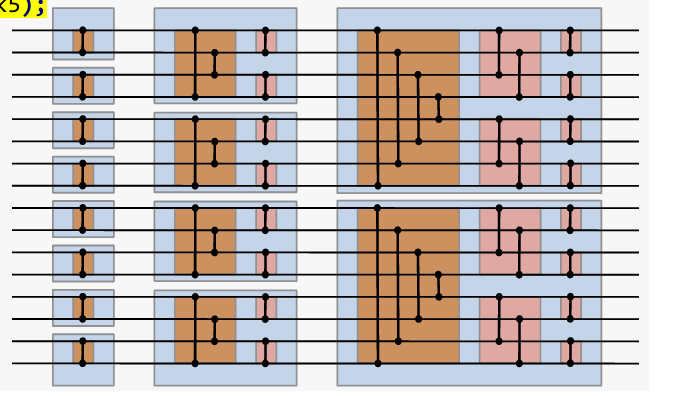

# CppCon2020:Adventures in SIMD Thinking
本文是cppcon20的一篇文章，分上下两个系列，是基于AVX512来优化几个实际案例，并对常见的simd操作进行了简单的封装，本文对于hpc场景还是有借鉴意义的，因为本文处理的问题都不是简单用loop unrolling来解决的
## basic SIMD Operation
首先作者对常见的simd操作进行封装，比较有用的包括permute，循环位移，按位取值，双调排序等，完整的代码如下，原文中有些错误和省略的地方我这里都加上了，具体每个函数的定义可看原文PPT:
```cpp
#include <cstdio>
#include <cstdint>
#include <iostream>
#include <type_traits>
#include <math.h>
#include <algorithm>
#include <immintrin.h> // 包含 AVX-512 指令集
#include <iomanip> 
#include <chrono>
#ifdef __OPTIMIZE__
    #define KEWB_FORCE_INLINE inline __attribute__((__always_inline__))
#else
    #define __OPTIMIZE__
    #define KEWB_FORCE_INLINE inline
#endif

namespace simd {
    using rf_512 = __m512;
    using ri_512 = __m512i;
    using msk_512 = uint32_t;

    // 加载单个值到 AVX-512 寄存器
    KEWB_FORCE_INLINE rf_512 load_value(float fill) {
        return _mm512_set1_ps(fill);
    }
    KEWB_FORCE_INLINE ri_512 load_value(int32_t fill)
    {
        return _mm512_set1_epi32(fill);
    }
    KEWB_FORCE_INLINE rf_512 load_from(float const* psrc)
    {
        return _mm512_loadu_ps(psrc);
    }
    KEWB_FORCE_INLINE rf_512 masked_load_from(float const* psrc, float fill, msk_512 mask)
    {
        return _mm512_mask_loadu_ps(_mm512_set1_ps(fill), (__mmask16) mask, psrc);
    }
    KEWB_FORCE_INLINE rf_512 masked_load_from(float const* psrc, rf_512 fill, msk_512 mask)
    {
        return _mm512_mask_loadu_ps(fill, (__mmask16) mask, psrc);
    }
    KEWB_FORCE_INLINE void store_to(float* pdst, rf_512 r)
    {
        _mm512_mask_storeu_ps(pdst, (__mmask16) 0xFFFFu, r);
    }
    KEWB_FORCE_INLINE void masked_store_to(float* pdst, rf_512 r, msk_512 mask)
    {
        _mm512_mask_storeu_ps(pdst, (__mmask16) mask, r);
    }
    template<unsigned A=0, unsigned B=0, unsigned C=0, unsigned D=0,
    unsigned E=0, unsigned F=0, unsigned G=0, unsigned H=0,
    unsigned I=0, unsigned J=0, unsigned K=0, unsigned L=0,
    unsigned M=0, unsigned N=0, unsigned O=0, unsigned P=0>
    KEWB_FORCE_INLINE constexpr uint32_t make_bit_mask()
    {
        static_assert(((A < 2) && (B < 2) && (C < 2) && (D < 2) && 
                    (E < 2) && (F < 2) && (G < 2) && (H < 2) && 
                    (I < 2) && (J < 2) && (K < 2) && (L < 2) && 
                    (M < 2) && (N < 2) && (O < 2) && (P < 2)));
        return ((A << 0) | (B << 1) | (C << 2) | (D << 3) | 
            (E << 4) | (F << 5) | (G << 6) | (H << 7) | 
            (I << 8) | (J << 9) | (K << 10) | (L << 11) | 
            (M << 12) | (N << 13) | (O << 14) | (P << 15));
    }
    KEWB_FORCE_INLINE uint32_t make_bit_mask_from_string(const std::string& str) {
        if (str.size() != 16)
            throw std::invalid_argument("Bitmask string must be 16 characters long");

        uint32_t mask = 0;
        for (size_t i = 0; i < 16; ++i) {
            char c = str[i]; // 从最低位开始
            if (c == '1') {
                mask |= (1u << i);
            } else if (c != '0') {
                throw std::invalid_argument("Bitmask string must contain only '0' or '1'");
            }
        }
        return mask;
    }
    KEWB_FORCE_INLINE rf_512 blend(rf_512 a, rf_512 b, msk_512 mask)
    {
        return _mm512_mask_blend_ps((__mmask16) mask, a, b);
    }
    KEWB_FORCE_INLINE rf_512 permute(rf_512 r, ri_512 perm)
    {
        return _mm512_permutexvar_ps(perm, r);
    }
    // KEWB_FORCE_INLINE rf_512 masked_permute(rf_512 a, rf_512 b, ri_512 perm, msk_512 mask)
    // {
    //     return _mm512_maskz_permutevar_ps(a, (__mmask16) mask, perm, b);
    // }
    KEWB_FORCE_INLINE rf_512 masked_permute(rf_512 a, rf_512 b, ri_512 perm, msk_512 mask) {
        return _mm512_mask_permutexvar_ps(a, (__mmask16)mask, perm, b);
    }
    
    template<unsigned A, unsigned B, unsigned C, unsigned D,
    unsigned E, unsigned F, unsigned G, unsigned H,
    unsigned I, unsigned J, unsigned K, unsigned L,
    unsigned M, unsigned N, unsigned O, unsigned P>
    KEWB_FORCE_INLINE ri_512 make_perm_map()
    {
        static_assert(((A < 16) && (B < 16) && (C < 16) && (D < 16) &&
                    (E < 16) && (F < 16) && (G < 16) && (H < 16) &&
                    (I < 16) && (J < 16) && (K < 16) && (L < 16) &&
                    (M < 16) && (N < 16) && (O < 16) && (P < 16)));
        return _mm512_setr_epi32(A, B, C, D, E, F, G, H, I, J, K, L, M, N, O, P);
    }
    template<int R> KEWB_FORCE_INLINE rf_512 rotate(rf_512 r)
    {
        if constexpr ((R % 16) == 0)
        {
            return r;
        }
        else
        {
            constexpr int S = (R > 0) ? (16 - (R % 16)) : -R;
            constexpr int A = (S + 0) % 16;
            constexpr int B = (S + 1) % 16;
            constexpr int C = (S + 2) % 16;
            constexpr int D = (S + 3) % 16;
            constexpr int E = (S + 4) % 16;
            constexpr int F = (S + 5) % 16;
            constexpr int G = (S + 6) % 16;
            constexpr int H = (S + 7) % 16;
            constexpr int I = (S + 8) % 16;
            constexpr int J = (S + 9) % 16;
            constexpr int K = (S + 10) % 16;
            constexpr int L = (S + 11) % 16;
            constexpr int M = (S + 12) % 16;
            constexpr int N = (S + 13) % 16;
            constexpr int O = (S + 14) % 16;
            constexpr int P = (S + 15) % 16;
            return _mm512_permutexvar_ps(_mm512_setr_epi32(A, B, C, D, E, F, G, H, I, J, K, L, M, N, O, P), r);
       }
    }
    
    template<int R> KEWB_FORCE_INLINE rf_512 rotate_down(rf_512 r)
    {
        static_assert(R >= 0);
        return rotate<-R>(r);
    }
    template<int R> KEWB_FORCE_INLINE rf_512 rotate_up(rf_512 r)
    {
        static_assert(R >= 0);
        return rotate<R>(r);
    }
    template<int S>
    KEWB_FORCE_INLINE constexpr __mmask16 shift_down_blend_mask() {
        static_assert(S >= 0 && S <= 16);
        // 16-bit mask，从低位开始，前 (16 - S) 位为 1，后 S 位为 0
        return (1 << (16 - S)) - 1;
    }
    template<int S> KEWB_FORCE_INLINE rf_512 shift_down(rf_512 r)
    {
        static_assert(S >= 0 && S <= 16);
        return blend(rotate_down<S>(r), load_value(0.0f), shift_down_blend_mask<S>());
    }
    template<int S>
    KEWB_FORCE_INLINE rf_512 shift_down_with_carry(rf_512 a, rf_512 b)
    {
        static_assert(S >= 0 && S <= 16);
        return blend(rotate_down<S>(a), rotate_down<S>(b), shift_down_blend_mask<S>());
    }
    template<int S>
    KEWB_FORCE_INLINE constexpr __mmask16 shift_up_blend_mask() {
        static_assert(S >= 0 && S <= 16);
        return (S == 0) ? 0xFFFF : (~((1 << S) - 1)) & 0xFFFF;
    }
    template<int S>
    KEWB_FORCE_INLINE rf_512 shift_up(rf_512 r0)
    {
        static_assert(S >= 0 && S <= 16);
        return blend(rotate_up<S>(r0), load_value(0.0f), shift_up_blend_mask<S>());
    }
    template<int S>
    KEWB_FORCE_INLINE rf_512 shift_up_with_carry(rf_512 lo, rf_512 hi)
    {
        static_assert(S >= 0 && S <= 16);
        return blend(rotate_up<S>(lo), rotate_up<S>(hi), shift_up_blend_mask<S>());
    }
    template<int S, msk_512 BMask>
    KEWB_FORCE_INLINE ri_512 make_shift_permutation()
    {
        static_assert(S >= 0 && S <= 16);

        return _mm512_setr_epi32(
            (S + 0  < 16) ? (S + 0 ) : (S + 0  - 16 + 16),
            (S + 1  < 16) ? (S + 1 ) : (S + 1  - 16 + 16),
            (S + 2  < 16) ? (S + 2 ) : (S + 2  - 16 + 16),
            (S + 3  < 16) ? (S + 3 ) : (S + 3  - 16 + 16),
            (S + 4  < 16) ? (S + 4 ) : (S + 4  - 16 + 16),
            (S + 5  < 16) ? (S + 5 ) : (S + 5  - 16 + 16),
            (S + 6  < 16) ? (S + 6 ) : (S + 6  - 16 + 16),
            (S + 7  < 16) ? (S + 7 ) : (S + 7  - 16 + 16),
            (S + 8  < 16) ? (S + 8 ) : (S + 8  - 16 + 16),
            (S + 9  < 16) ? (S + 9 ) : (S + 9  - 16 + 16),
            (S + 10 < 16) ? (S + 10) : (S + 10 - 16 + 16),
            (S + 11 < 16) ? (S + 11) : (S + 11 - 16 + 16),
            (S + 12 < 16) ? (S + 12) : (S + 12 - 16 + 16),
            (S + 13 < 16) ? (S + 13) : (S + 13 - 16 + 16),
            (S + 14 < 16) ? (S + 14) : (S + 14 - 16 + 16),
            (S + 15 < 16) ? (S + 15) : (S + 15 - 16 + 16)
        );
    }

    template<int S>
    KEWB_FORCE_INLINE void in_place_shift_down_with_carry(rf_512& a, rf_512& b)
    {
        static_assert(S >= 0 && S <= 16);
        constexpr msk_512 zmask = (0xFFFFu >> (unsigned) S);
        constexpr msk_512 bmask = ~zmask & 0xFFFFu;
        ri_512 perm = make_shift_permutation<S, bmask>();
        a = _mm512_permutex2var_ps(a, perm, b);
        b = _mm512_maskz_permutex2var_ps((__mmask16) zmask, b, perm, b);
    }
    KEWB_FORCE_INLINE rf_512 fused_multiply_add(rf_512 a, rf_512 b, rf_512 c)
    {
        return _mm512_fmadd_ps(a, b, c);
    }
    KEWB_FORCE_INLINE rf_512 minimum(rf_512 a, rf_512 b)
    {
        return _mm512_min_ps(a, b);
    }
    KEWB_FORCE_INLINE rf_512 maximum(rf_512 a, rf_512 b)
    {
        return _mm512_max_ps(a, b);
    }
    KEWB_FORCE_INLINE rf_512 compare_with_exchange(rf_512 vals, ri_512 perm, msk_512 mask)
    {
        rf_512 exch = permute(vals, perm);
        rf_512 vmin = minimum(vals, exch);
        rf_512 vmax = maximum(vals, exch);

        return blend(vmin, vmax, mask);
    }
    KEWB_FORCE_INLINE rf_512 sort_two_lanes_of_8(rf_512 vals)
    {
        // Precompute the permutations and bitmasks for the 6 stages of this bitonic sorting sequence.
        //                         0  1  2  3  4  5  6  7    0  1  2  3  4  5  6  7
        // -------------------------------------------------------------------------

        ri_512 const perm0 = make_perm_map<1, 0, 3, 2, 5, 4, 7, 6,   9, 8, 11,10,13,12,15,14>();
        constexpr msk_512 mask0 = make_bit_mask<0, 1, 0, 1, 0, 1, 0, 1,   0, 1, 0, 1, 0, 1, 0, 1>();

        ri_512 const perm1 = make_perm_map<3, 2, 1, 0, 7, 6, 5, 4,   11,10,9, 8, 15,14,13,12>();
        constexpr msk_512 mask1 = make_bit_mask<0, 0, 1, 1, 0, 0, 1, 1,   0, 0, 1, 1, 0, 0, 1, 1>();

        ri_512 const perm2 = make_perm_map<1, 0, 3, 2, 5, 4, 7, 6,   9, 8, 11,10,13,12,15,14>();
        constexpr msk_512 mask2 = make_bit_mask<0, 1, 0, 1, 0, 1, 0, 1,   0, 1, 0, 1, 0, 1, 0, 1>();

        ri_512 const perm3 = make_perm_map<7, 6, 5, 4, 3, 2, 1, 0,   15,14,13,12,11,10,9, 8>();
        constexpr msk_512 mask3 = make_bit_mask<0, 0, 0, 0, 1, 1, 1, 1,   0, 0, 0, 0, 1, 1, 1, 1>();

        ri_512 const perm4 = make_perm_map<2, 3, 0, 1, 6, 7, 4, 5,   10,11,8, 9, 14,15,12,13>();
        constexpr msk_512 mask4 = make_bit_mask<0, 0, 1, 1, 0, 0, 1, 1,   0, 0, 1, 1, 0, 0, 1, 1>();

        ri_512 const perm5 = make_perm_map<1, 0, 3, 2, 5, 4, 7, 6,   9, 8, 11,10,13,12,15,14>();
        constexpr msk_512 mask5 = make_bit_mask<0, 1, 0, 1, 0, 1, 0, 1,   0, 1, 0, 1, 0, 1, 0, 1>();
        vals=compare_with_exchange(vals,perm0,mask0);
        vals=compare_with_exchange(vals,perm1,mask1);
        vals=compare_with_exchange(vals,perm2,mask2);
        vals=compare_with_exchange(vals,perm3,mask3);
        vals=compare_with_exchange(vals,perm4,mask4);
        vals=compare_with_exchange(vals,perm5,mask5);
        return vals;
    }
}
```
## Solution1: Scalar vs AVX-512 Median of 7
本章的目的是加速7点中值滤波，这在信号处理是常见的一种场景，一般用于平滑图像，为了实现该目标，首先我们要实现应该基础版本，8点快速排序，那么在avx512下也就是两个8点快速排序，具体思路如下图所示，利用了双调排序的思想，对于8点来说，先生成2个4长度的双调序列，再进行2个4长度双调排序即可，具体代码实现上，每次双调都是两两元素比较，对于simd512就是2元素permute换位置后，和原位置元素max和min各获得一组值，再mask获得对应最小值和最大值就可实现

其代码实现如下:
```cpp
KEWB_FORCE_INLINE rf_512 sort_two_lanes_of_8(rf_512 vals)
    {
        // Precompute the permutations and bitmasks for the 6 stages of this bitonic sorting sequence.
        //                         0  1  2  3  4  5  6  7    0  1  2  3  4  5  6  7
        // -------------------------------------------------------------------------

        ri_512 const perm0 = make_perm_map<1, 0, 3, 2, 5, 4, 7, 6,   9, 8, 11,10,13,12,15,14>();
        constexpr msk_512 mask0 = make_bit_mask<0, 1, 0, 1, 0, 1, 0, 1,   0, 1, 0, 1, 0, 1, 0, 1>();

        ri_512 const perm1 = make_perm_map<3, 2, 1, 0, 7, 6, 5, 4,   11,10,9, 8, 15,14,13,12>();
        constexpr msk_512 mask1 = make_bit_mask<0, 0, 1, 1, 0, 0, 1, 1,   0, 0, 1, 1, 0, 0, 1, 1>();

        ri_512 const perm2 = make_perm_map<1, 0, 3, 2, 5, 4, 7, 6,   9, 8, 11,10,13,12,15,14>();
        constexpr msk_512 mask2 = make_bit_mask<0, 1, 0, 1, 0, 1, 0, 1,   0, 1, 0, 1, 0, 1, 0, 1>();

        ri_512 const perm3 = make_perm_map<7, 6, 5, 4, 3, 2, 1, 0,   15,14,13,12,11,10,9, 8>();
        constexpr msk_512 mask3 = make_bit_mask<0, 0, 0, 0, 1, 1, 1, 1,   0, 0, 0, 0, 1, 1, 1, 1>();

        ri_512 const perm4 = make_perm_map<2, 3, 0, 1, 6, 7, 4, 5,   10,11,8, 9, 14,15,12,13>();
        constexpr msk_512 mask4 = make_bit_mask<0, 0, 1, 1, 0, 0, 1, 1,   0, 0, 1, 1, 0, 0, 1, 1>();

        ri_512 const perm5 = make_perm_map<1, 0, 3, 2, 5, 4, 7, 6,   9, 8, 11,10,13,12,15,14>();
        constexpr msk_512 mask5 = make_bit_mask<0, 1, 0, 1, 0, 1, 0, 1,   0, 1, 0, 1, 0, 1, 0, 1>();
        vals=compare_with_exchange(vals,perm0,mask0);
        vals=compare_with_exchange(vals,perm1,mask1);
        vals=compare_with_exchange(vals,perm2,mask2);
        vals=compare_with_exchange(vals,perm3,mask3);
        vals=compare_with_exchange(vals,perm4,mask4);
        vals=compare_with_exchange(vals,perm5,mask5);
        return vals;
    }
```
之后实现中值滤波，这里是7个点而不是8个点，因为7个点直接排序后取第三个就是中值，但是7个点的话就不能直接unroll，需要利用滑动窗口的思想移位比较，首先给出标量版本,就是排序7取第三个
```cpp
void scalar_median_of_7(float* pdst, const float* psrc, size_t len) {
    for (size_t i = 3; i < len - 3; ++i) {
        float window[7] = {
            psrc[i - 3], psrc[i - 2], psrc[i - 1],
            psrc[i], psrc[i + 1], psrc[i + 2], psrc[i + 3]
        };
        std::sort(window, window + 7);
        pdst[i] = window[3]; // 取中位数
    }
    // 边界填充
    for (size_t i = 0; i < 3; ++i)
        pdst[i] = psrc[i];
    for (size_t i = len - 3; i < len; ++i)
        pdst[i] = psrc[i];
}
```
再给出avx512实现，首先取 16 个输入值，在进行窗口展开，通过 `shift_up_with_carry` 和 `shift_down_with_carry` 构造滑动窗口，每次移动3，因为7位取中值前面要有3个，所以从第3位开始滤波，接着使用比较-交换网络，直接算出每个窗口的中值，最后通过 `masked_permute` 和 `save_mask` 把中值写回数组，代码实现如下:
```cpp
    KEWB_FORCE_INLINE rf_512 sort_two_lanes_of_7(rf_512 vals){
        const __mmask16 mask = (1 << 7) | (1 << 15);
        rf_512 nan_vec = _mm512_set1_ps(0xfffff);
        vals=_mm512_mask_blend_ps(mask, vals, nan_vec);
        return sort_two_lanes_of_8(vals);
    }
    void avx_median_of_7(float* pdst, float const* psrc, size_t const buf_len)
    {
        rf_512 prev; //- Bottom of the input data window
        rf_512 curr; //- Middle of the input data window
        rf_512 next; //- Top of the input data window
        rf_512 lo; //- Primary work register
        rf_512 hi; //- Upper work data register; feeds values into the top of 'lo'
        rf_512 data; //- Holds output prior to store operation
        rf_512 work; //- Accumulator

        rf_512 const first = load_value(psrc[0]);

        //- This permutation specifies how to load the two lanes of 7.
        //
        ri_512 const load_perm = make_perm_map<0,1,2,3,4,5,6,7,1,2,3,4,5,6,7,8>();

        //- This permutation specifies which elements to save.
        //
        ri_512 const save_perm = make_perm_map<3,11,3,11,3,11,3,11,3,11,3,11,3,11,3,11>();
        constexpr msk_512 save = make_bit_mask<1,1>();
        // - This array of bitmasks specifies which pair of elements to blend into the result.
        constexpr msk_512 save_mask[8] = {save << 0, save << 2, save << 4, save << 6,
                                        save << 8, save << 10, save << 12, save << 14};
        size_t read = 0;
        size_t wrote = 0;
        curr = first;
        next = load_from(psrc);
        read += 16;
        while (read < (buf_len + 16))
        {
            prev = curr;
            curr = next;
            next = load_from(psrc + read);
            read += 16;

            lo = shift_up_with_carry<3>(prev, curr); //- Init the work data registers to the
                                                    // correct offset in the input data window
            hi = shift_up_with_carry<3>(curr, next);

            for (int i = 0; i < 8; ++i)            //- Perform two sorts of 7 at a time, in lanes of 8
            {
                work = permute(lo, load_perm);
                work = sort_two_lanes_of_7(work);
                data = masked_permute(data, work, save_perm, save_mask[i]);
                in_place_shift_down_with_carry<2>(lo, hi);
            }

            store_to(pdst + wrote, data);
            wrote += 16;
        }
                
    }
```
## Sloution2: Fast small kernel convolution
本章是利用avx来优化卷积运算，这里的卷积应该指的是信号处理的卷积运算，主要用于平滑和去噪，可以简化为窗口乘法，基础库就不在介绍了，同样使用移动窗口，一次处理16个点，拼2个512是为了不用重复加载数据，直接改成simd的话可能需要在第二重循环里一直load，这是一个比较重要的优化点
```cpp
template<int KernelSize, int KernelCenter> void
avx_convolve(float* pdst, float const* pkrnl, float const* psrc, size_t len)
{
    constexpr int WindowCenter = KernelSize - KernelCenter - 1;

    rf_512 prev;  //- Bottom of the input data window
    rf_512 curr;  //- Middle of the input data windows
    rf_512 next;  //- Top of the input data window
    rf_512 lo;    //- Primary work data register, used to multiply kernel coefficients
    rf_512 hi;    //- Upper work data register, supplies values to the top of 'lo'
    rf_512 sum;   //- Accumulated value
    rf_512 kcoeff[KernelSize];  //- Coefficients of the convolution kernel

    //- Broadcast each kernel coefficient into its own register, to be used later in the FMA calculation.
    for (int i = 0, j = KernelSize - 1; i < KernelSize; ++i, --j)
    {
        kcoeff[i] = load_value(pkrnl[j]);
    }

    //- Preload the initial input data window; note the zeroes in the register representing data preceding the input array.
    prev = load_value(0.0f);
    curr = load_from(psrc);
    next = load_from(psrc + 16);
    for (auto pEnd = psrc + len - 16; psrc < pEnd; psrc += 16, pdst += 16)
    {
        sum = load_value(0.0f);  //- Init the accumulator

        lo = shift_up_with_carry<WindowCenter>(prev, curr);  //- Init the work data registers
        hi = shift_up_with_carry<WindowCenter>(curr, next);

        prev = curr;
        curr = next;
        next = load_from(psrc + 32);  //- Slide the input data window by a register's worth

        for (int k = 0; k < KernelSize; ++k)
        {
            sum = fused_multiply_add(kcoeff[k], lo, sum);  //- Update the accumulated value
            in_place_shift_down_with_carry<1>(lo, hi);
        }
        store_to(pdst, sum);
    }

}

```