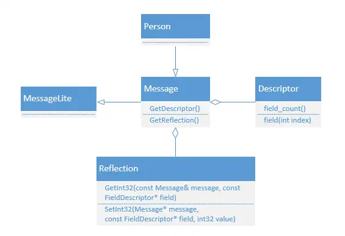

# 1. protobuf简介
Protobuf(pb)是一种常见的数据序列化方式,常常用于进程间序列化信息传递,相对于传统的csv,json等,pb在缩小可读性的基础上,不仅结构体积小,而且解析速度快,其对比如下图所示:
|特性\类型|	xml	|json	|protobuf|
|----|----|----|----|
|数据结构支持	|简单结构|	简单结构|	复杂结构|
|数据保存方式|	文本|	文本|	二进制|
|数据保存大小|大	|大	|小|
|编解码效率	|慢|	慢	|快|
|语言支持程度|	覆盖主流语言|	覆盖主流语言|	覆盖主流语言|

后端常用于微服务信息传递,也广泛用于自动驾驶场景中,用于实现低延时,可靠
的进程间通信结构,因此为了实现通信中间件,需要对protobuf及其反射原理进行调研
# 2.pb反射使用
Message成员变量类图:

一般使用 PB 反射的步骤如下：
1. 通过Message获取单个字段的FieldDescriptor
2. 通过Message获取其Reflection
3. 通过Reflection来操作FieldDescriptor，从而动态获取或修改单个字段
获取 Descript、Reflection 的函数：
```cpp
const google::protobuf::Reflection* pReflection = pMessage->GetReflection();
const google::protobuf::Descriptor* pDescriptor = pMessage->GetDescriptor();
```
我们要明确为什么pb为什么需要反射,以我所在的自驾行业为例,自驾中需要传递的数据非常多，传感器采集信息包括相机，激光雷达，毫米波雷达，导航信息，gnss等，而planning，感知，预测等又会产生很多message，因此需要定义大量pb结构，如果使用get/set读写这些特征，那每个pb格式都要写一遍实现代码，因此我们需要反射来简化这个流程，pb反射流程如下:  
1. 根据messageName获取Descriptor
```cpp
const google::protobuf::Descriptor* desc =
            google::protobuf::DescriptorPool::generated_pool()->FindMessageTypeByName(msg_name);
```
2. 根据descriptor获取Message
```cpp
google::protobuf::Message* message =
                google::protobuf::MessageFactory::generated_factory()->GetPrototype(desc)->New();
```
3. 获取对应的reflection
```cpp
const google::protobuf::Reflection* reflection = message->GetReflection();
```
4. 获取fileDescription,filed_name就是具体字段名
```cpp
const google::protobuf::FieldDescriptor* field_descriptor = desc->FindFieldByName(filed_name);
google::protobuf::Message* header = reflection->MutableMessage(msg.get(), field_descriptor);
```
之后就可以操作对应的Message了
# 3.利用反射完成非空字段的选取
我们以一个具体场景为例,那就是实现对pb对象中非空字段的选取，其代码如下:
```cpp
int PbToMap(const google::protobuf::Message &message,
            std::map<std::string, std::string> &out) {
#define CASE_FIELD_TYPE(cpptype, method, valuetype)                            \
  case google::protobuf::FieldDescriptor::CPPTYPE_##cpptype: {                 \
    valuetype value = reflection->Get##method(message, field);                 \
    std::ostringstream oss;                                                    \
    oss << value;                                                              \
    out[field->name()] = oss.str();                                            \
    break;                                                                     \
  }

#define CASE_FIELD_TYPE_ENUM()                                                 \
  case google::protobuf::FieldDescriptor::CPPTYPE_ENUM: {                      \
    int value = reflection->GetEnum(message, field)->number();                 \
    std::ostringstream oss;                                                    \
    oss << value;                                                              \
    out[field->name()] = oss.str();                                            \
    break;                                                                     \
  }

#define CASE_FIELD_TYPE_STRING()                                               \
  case google::protobuf::FieldDescriptor::CPPTYPE_STRING: {                    \
    std::string value = reflection->GetString(message, field);                 \
    out[field->name()] = value;                                                \
    break;                                                                     \
  }

  const google::protobuf::Descriptor *descriptor = message.GetDescriptor();
  const google::protobuf::Reflection *reflection = message.GetReflection();

  for (int i = 0; i < descriptor->field_count(); i++) {
    const google::protobuf::FieldDescriptor *field = descriptor->field(i);
    bool has_field = reflection->HasField(message, field);

    if (has_field) {
      if (field->is_repeated()) {
        return -1; // 不支持转换repeated字段
      }

      const std::string &field_name = field->name();
      switch (field->cpp_type()) {
        CASE_FIELD_TYPE(INT32, Int32, int);
        CASE_FIELD_TYPE(UINT32, UInt32, uint32_t);
        CASE_FIELD_TYPE(FLOAT, Float, float);
        CASE_FIELD_TYPE(DOUBLE, Double, double);
        CASE_FIELD_TYPE(BOOL, Bool, bool);
        CASE_FIELD_TYPE(INT64, Int64, int64_t);
        CASE_FIELD_TYPE(UINT64, UInt64, uint64_t);
        CASE_FIELD_TYPE_ENUM();
        CASE_FIELD_TYPE_STRING();
      default:
        return -1; // 其他异常类型
      }
    }
  }

  return 0;
}
```